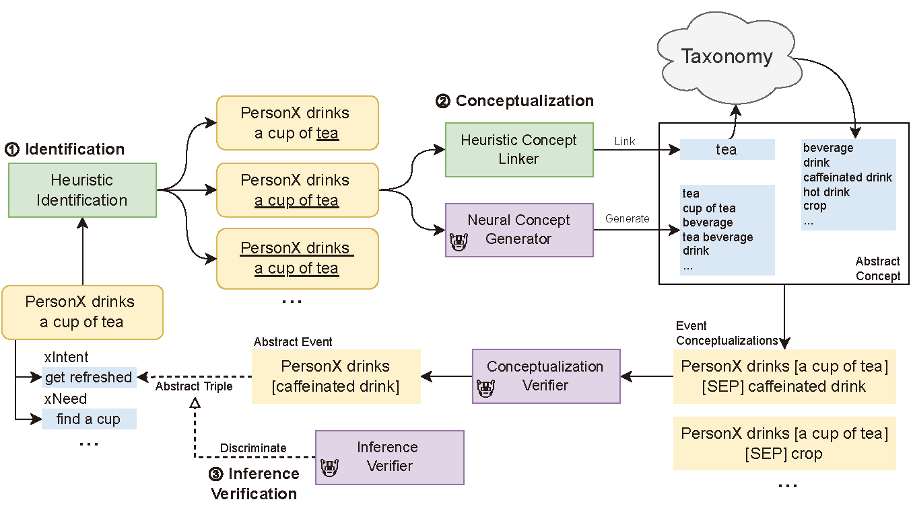

# Acquiring and Modelling Abstract Commonsense Knowledge via Conceptualization
This repository contains the code and data in our paper to be published, with each part introduced below. 
`requirements.txt` for each part of the repository are given respectively.

Below introduces the dataset format and the steps to implement or reproduce our framework as described in the paper.



## Paper
```
@misc{he2022acquiring,
      title={Acquiring and Modelling Abstract Commonsense Knowledge via Conceptualization}, 
      author={Mutian He and Tianqing Fang and Weiqi Wang and Yangqiu Song},
      year={2022},
      eprint={2206.01532},
      archivePrefix={arXiv},
      primaryClass={cs.CL}
}
```

[Paper Link](https://arxiv.org/abs/2206.01532)

## Dataset & Pretrained Models

Our annotated data are given in `conceptualizer/data`, including `stage2_combined.json` for event conceptualizations
and `stage3_combined.neg2.json` for abstract triples.

Intermediate ATOMIC parsing results are also given in `conceptualizer/parse`, as mentioned above.
Experiment data built upon ATOMIC and our data are given in `discriminator/data` or `discriminator/gen`.

Pretrained models and **Abstract ATOMIC** are available [here](https://hkustconnect-my.sharepoint.com/:f:/g/personal/mhear_connect_ust_hk/Eo1sMdC6DalKtOllhrDXohABihrryFFd1MqJ9a_KPoqj6w?e=KWwaGy).

Slight improvements in the data processing codes have been carried out after that, so the data that
could be produced by the pipeline here are not exactly the same as the released, but the difference is very minor.
Abstract ATOMIC data refer to the released version.

# Identification & Heuristic Concept Linker

Below we introduce the steps to perform identification and heuristic concept linking upon ATOMIC as in our framework.
It should be noted that some functions, classes, properties, etc. included in the code are not used in the current 
version of the pipeline and experiments.

First download the [Probase](http://concept.research.microsoft.com/Home/Download) to
`~/data/probase/data-concept-instance-relations.txt`, and run `probase_server.py`
in the backend. Other data are included in this repository, including ATOMIC, processed NOMBANK, etc.

Then run the `conceptualizer/atomic_parse.py` following the instructions inside at the end of the file.
Particularly, after running Part 1 and Part 2, 
`glossbert.csv` is built. Use it as the input to the [GlossBERT model](https://github.com/HSLCY/GlossBERT) following
their _test_ instructions using `run_classifier_WSD_sent`, with `--eval_data_dir` replaced to the `glossbert.csv` 
produced. After that, copy the `results.txt` to `parse`, rename it to`glossbert_results.txt`, and run Part 3.

As a result, following files are produced as outputs:
<ul>
<li>heads.5.txt: Head events after preprocessing. Empty lines are for the excluded ATOMIC events.
It should be noted that after the preprocessing of texts there can be duplicate head events (though with different 
tails), and we keep all of them to keep track of the process and maintain the consistency with the original ATOMIC data.
</li>
<li>docs.jsonl: Parsed head events. Each line is a json string, a list of dicts. Each dict correspond to a token.
Properties are derived from the spacy parsing results, plus markers of `predicate` (whether it is a predicative
candidate), `nominal` (whether it is a nominal candidate), `prep` (whether it is prepositional), `modifier` (whether
it is some other modifier).
</li>
<li>components.jsonl: Conceptualization candidates in each event. Each line contains a list, and each element of the
list is the index of the head token for the candidate.</li>
<li>linked_concepts.2.jsonl: Events with linked WordNet/Probase concepts. </li>
<li>exclusion.json: Events excluded. </li>
</ul>

`linked_concepts.2.jsonl` consists of multiple lines in the original ATOMIC order, each corresponds to an event, 
represented as List[Candidate]. Each Candidate contains the linked concepts from a conceptualization candidate, which
is a constituent in the event. A candidate is further split into _variations_. Recall that as mentioned in the paper 
(see Table 2), we may try to link concepts from different part of a constiuent. For example, the 
phrase/constituent “a group of people” might be linked to both “group” and “people”, and the case is similar for “the
city of new york”, “PersonX wants to leave”, etc. Hence each Candidate is is a List[Variation], 
and each Variation corresponds to linked concepts based on a specific head word within the constituent. 

Each variation is a List[LinkedConcept], and each LinkConcept is a Tuple[Modifiers, Senses, Text, Left, Right]].
with each element a concept linked. To explain the properties of the LinkedConcept,
Modifiers is List[Int] for the indices of tokens that are found to be the modifer
of the concept, such as “_black_ dog”, though this part is currently not used. 
Senses is List[[Sense, Score]], in which Sense is either the WordNet synset linked to the concept
, along with Score from GlossBERT when applicable.
Text is the textual concept, which equals to the Probase concept name if it is linked to Probase.
Left and Right are the span of the concept in the original text in token indices.
It should be noted that Text might be different from the original text in the event as indicated by Left and Right since
we try to match it with the name of the Probase concepts.


# Neural Models

Below we introduce the steps to build the neural models in our framework upon annotated data.

## Concept Generator
The code is available in `generator/`, based on the official COMET implementation. 
To train the model, run under the directory

`
IN_LEN=40 OUT_LEN=46 OUT_DIR=OUTPUT_PATH SAVE_EVERY_EPOCH=False DO_PRED_EVERY_EPOCH=False EVAL_EVERY=500 USE_NL_RELATION=True TRAIN_BATCH_SIZE=32 VALID_BATCH_SIZE=32 DO_TRAIN=True DO_PRED=False TRAIN_EPOCHS=30 TOKENIZER=gpt2 GPT2_MODEL=gpt2 TRAIN_DATA_PATH=../discriminator/gen/stage2_all.nl/trn.tsv DEV_DATA_PATH=../discriminator/gen/stage2_all.nl/dev.tsv TEST_DATA_PATH=../discriminator/gen/stage2_all.nl/tst.tsv PRED_FILE=../discriminator/gen/stage2_all.nl/dev.tsv USE_NL_RELATION=True REPLACE_BRACKET=True python models/comet_atomic2020_gpt2/comet_concept_gpt2.py
`

, with OUTPUT_PATH substituted to your own one. Or you may use our pretrained model. It will only save the model when
the minimum eval loss is updated, so the best model will be the best_STEP_model with the largest STEP.
Then you may evaluate it with

`
IN_LEN=40 OUT_LEN=52 SAVE_EVERY_EPOCH=False DO_PRED_EVERY_EPOCH=False EVAL_EVERY=500 USE_NL_RELATION=True TRAIN_BATCH_SIZE=32 VALID_BATCH_SIZE=32 DO_TRAIN=False DO_PRED=True OUT_DIR=RESULT_PATH TOKENIZER=gpt2 GPT2_MODEL=MODEL_PATH PRED_FILE=../discriminator/gen/stage2_all.nl/dev.tsv TRAIN_DATA_PATH=../discriminator/gen/stage2_all.nl/trn.tsv DEV_DATA_PATH=../discriminator/gen/stage2_all.nl/dev.tsv TEST_DATA_PATH=../discriminator/gen/stage2_all.nl/tst.tsv REPLACE_BRACKET=True python models/comet_atomic2020_gpt2/comet_concept_gpt2.py
`
, with MODEL_PATH (like `OUTPUT_PATH/best-model-3000`) and RESULT_PATH substituted to your own one.

## Conceptualization Verifier
The code is available in `discriminator/`, based on the Huggingface demo codes. 
To train the model, run under the directory

`
python main.py --model_name_or_path roberta-base --output_dir OUTPUT_PATH --do_train --do_eval --do_predict --per_device_train_batch_size 64 --learning_rate 2e-5 --num_train_epochs 10 --dataset split_atomic/stage2_all --overwrite_output_dir True --save_strategy steps --save_steps 500 --evaluation_strategy steps --logging_steps 500 --per_device_eval_batch_size 16 --eval_accumulation_steps 4`

, with OUTPUT_PATH substituted to your own one. Or you may use our pretrained model. Then you may evaluate it with

`
python main.py --model_name_or_path MODEL_PATH --output_dir RESULT_PATH --do_eval --do_predict --per_device_train_batch_size 64 --learning_rate 2e-5 --num_train_epochs 10 --dataset split_atomic/stage2_all --overwrite_output_dir True --save_strategy steps --save_steps 500 --evaluation_strategy steps --logging_steps 500 --per_device_eval_batch_size 16 --eval_accumulation_steps 4 --do_final_evaluations
`
, with MODEL_PATH (like `OUTPUT_PATH/checkpoint-3000`) and RESULT_PATH substituted to your own one.
Before that you may run `prepare_data.py` to split the data.

## Inference Verifier

Similar to the conceptualization verifier, but different in the dataset used. To train, use

`
python main.py --model_name_or_path roberta-base --output_dir OUTPUT_PATH --do_train --do_eval --do_predict --per_device_train_batch_size 64 --learning_rate 2e-5 --num_train_epochs 10 --dataset split_atomic/stage3_all.neg2 --overwrite_output_dir True --save_strategy steps --save_steps 500 --evaluation_strategy steps --logging_steps 500 --per_device_eval_batch_size 16 --eval_accumulation_steps 4
`

To evaluate, use 

`
python main.py --model_name_or_path MODEL_PATH --output_dir RESULT_PATH --do_eval --do_predict --per_device_train_batch_size 64 --learning_rate 2e-5 --num_train_epochs 10 --dataset split_atomic/stage3_all.neg2 --overwrite_output_dir True --save_strategy steps --save_steps 500 --evaluation_strategy steps --logging_steps 500 --per_device_eval_batch_size 16 --eval_accumulation_steps 4 --do_final_evaluations
`

# Abstract ATOMIC
Below we introduce the Abstract ATOMIC we built, based on the heuristic and neural components described above, as 
shared on OneDrive above.

As for event conceptualizations, the file (like `selected_heads\trn.json`) contains a single dict. The key is the 
original event with a conceptualization candidate identified. 
Each value is a dict as well, with its keys the abstract concept verified
by the models, and each value is a list of all sources of this event conceptualization, taken in the form 
of List[[Doc_i, Constituent_i]], since there are duplicate head events with different tails.
Doc_i is the ATOMIC index, and Constituent_i is the index of candidate constituent as in `components.jsonl`.
For example, an item in the dev split can be:
`
"[PersonX accepts PersonY's apology]": {"acceptance": [[17, 2]], "action": [[17, 2]], "conciliatory gesture": [[17, 2]], ...}
`
The key is an event, in which “PersonX accepts PersonY's apology” can be conceptualized to “acceptance”, 
“action”, etc., and it is originally from Event #17 and Constituent #2.

While for abstract triples the files (like `selected_triples_90`) are more self-explanatory. Additional information
is given in the `info` property, with `all_info` a similar list of List[[Doc_i, Constituent_i]], and `d_i`/`c_i` one
of the sources.

We also provide instructions to build the dataset, using the neural models above and
`conceptualizer/extend_kg.py` as follow:
1. Run the Part 1 of `extend_kg.py` in to prepare data.
2. Copy `conceptualizer/data/exp/*` to `discriminator/data`, and run `discriminator/prepare_data.py`.
3. For SPLIT in {trn, dev, tst}, run: 
`
IN_LEN=40 OUT_LEN=60 SAVE_EVERY_EPOCH=False DO_PRED_EVERY_EPOCH=False EVAL_EVERY=500 USE_NL_RELATION=True TRAIN_BATCH_SIZE=32 VALID_BATCH_SIZE=32 DO_TRAIN=False DO_EVAL=False DO_PRED=True OUT_DIR=population/extend_cand_head.nl/SPLIT TOKENIZER=gpt2 GPT2_MODEL=MODEL_PATH PRED_FILE=../discriminator/gen/extend_cand_head.nl/SPLIT.tsv TRAIN_DATA_PATH=../discriminator/gen/extend_cand_head.nl/trn.tsv DEV_DATA_PATH=../discriminator/gen/extend_cand_head.nl/tst.tsv TEST_DATA_PATH=../discriminator/gen/extend_cand_head.nl/tst.tsv REPLACE_BRACKET=True NUM_GEN=10 python models/comet_atomic2020_gpt2/comet_concept_gpt2.py
`, with MODEL_PATH the pretrained concept generator path.
4. Now the concept generator produced the abstract events to `generator/population/extend_cand_head.nl`. Run the Part 2 of `extend_kg.py`.
5. Run conceptualization verification on all produced data. For candidate abstract events from neural concept generator,
run `
python main.py --model_name_or_path MODEL_PATH --output_dir population/head_gen/SPLIT --do_predict --per_device_train_batch_size 64 --learning_rate 2e-5 --num_train_epochs 10 --dataset split_atomic/generated_heads/SPLIT.json --overwrite_output_dir True --logging_steps 500 --per_device_eval_batch_size 16 --eval_accumulation_steps 4 --do_final_evaluations
`. For candidate abstract events from heuristic concept linking & conceptualization, run `
python main.py --model_name_or_path MODEL_PATH --output_dir population/head/SPLIT --do_predict --per_device_train_batch_size 64 --learning_rate 2e-5 --num_train_epochs 10 --dataset split_atomic/extended_heads/SPLIT.json --overwrite_output_dir True --logging_steps 500 --per_device_eval_batch_size 16 --eval_accumulation_steps 4 --do_final_evaluations
`.
6. Run the Part 3 of `extend_kg.py`.
7. Run inference verification:
`
python main.py --model_name_or_path MODEL_PATH --output_dir population/triple/SPLIT --do_predict --per_device_train_batch_size 64 --learning_rate 2e-5 --num_train_epochs 10 --dataset split_atomic/extended_triples/SPLIT.json --overwrite_output_dir True --logging_steps 500 --per_device_eval_batch_size 128 --eval_accumulation_steps 4 --do_final_evaluations
`
8. Run the Part 4 of `extend_kg.py` to collect the final results.
